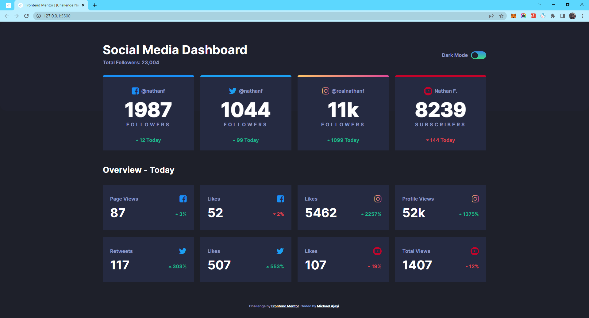

# Frontend Mentor - Social media dashboard with theme switcher solution

This is a solution to the [Social media dashboard with theme switcher challenge on Frontend Mentor](https://www.frontendmentor.io/challenges/social-media-dashboard-with-theme-switcher-6oY8ozp_H). Frontend Mentor challenges help you improve your coding skills by building realistic projects. 

## Table of contents

- [Overview](#overview)
  - [The challenge](#the-challenge)
  - [Screenshot](#screenshot)
  - [Links](#links)
- [My process](#my-process)
  - [Built with](#built-with)
  - [Continued development](#continued-development)
  - [Useful resources](#useful-resources)
- [Author](#author)

## Overview

### The challenge

Users should be able to:

- View the optimal layout for the site depending on their device's screen size
- See hover states for all interactive elements on the page
- Toggle color theme to their preference

### Screenshot

### Links

- Solution URL: [Add solution URL here](https://your-solution-url.com)
- Live Site URL: [Add live site URL here](https://your-live-site-url.com)

## My process

### Built with

- Semantic HTML5 markup
- CSS custom properties
- Flexbox
- Positioning
- CSS Grid
- Mobile-first workflow
- DOM Manipulation
- SASS/SCSS
- [Bootstrap](https://getbootstrap.com/docs/4.0/layout) - CSS library
- Node Package

### Continued development

I plan on using this idea to develop multi-themed websites. The whole concept of how the color scheme of a website can change the entire look of the site is very fascinating. I look further to working on more multi-themed websites

### Useful resources

- [A Complete Guide to Dark Mode](https://css-tricks.com/a-complete-guide-to-dark-mode-on-the-web/) - This is an amazing article and i would gladly recommend it to everyone and anyone who wants to learn about web themes and css variables.
- [Give Text or Icon a gradient color](https://stackoverflow.com/questions/48719337/how-to-give-gradient-color-to-icon) - This helped me in giving the icons that have gradients their colors. It has some cons to it as it is not supported by few other browers but it is supported by Chrome, FireFox, Microsoft Edge, Opera Mini.

## Author

- Website - [Michael Ajayi](https://michael-a.netlify.app)
- Frontend Mentor - [@michaelajayi150](https://www.frontendmentor.io/profile/michaelajayi150)
- Twitter - [@michaelajayi150](https://www.twitter.com/michaelajayi150)
- LinkedIn - [@ajayi-michael-692bb6203](https://www.linkedin.com/in/ajayi-michael-692bb6203/)
